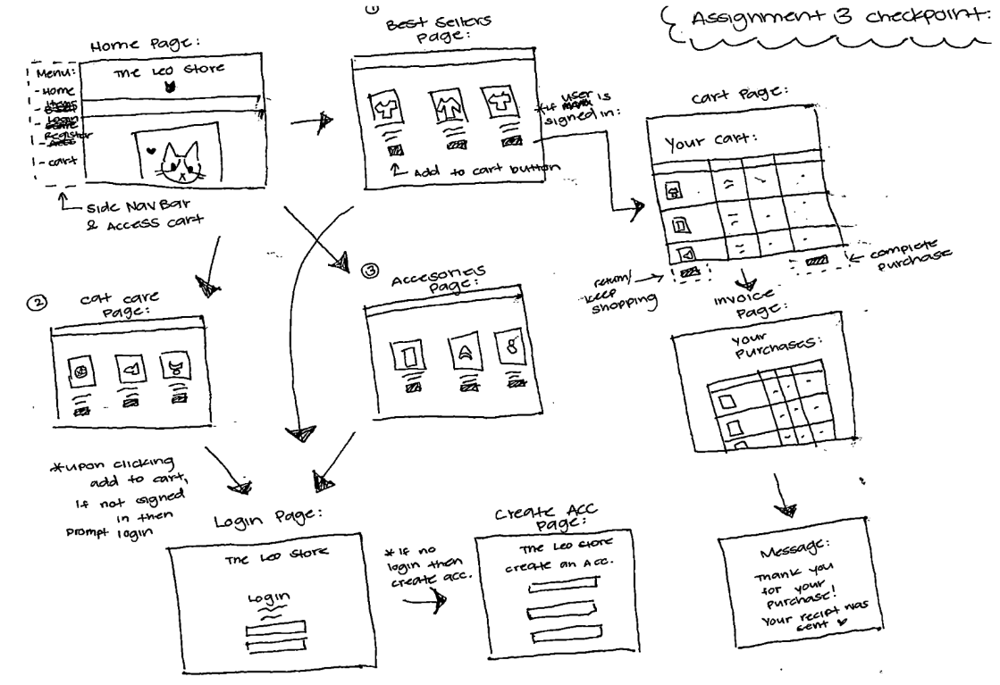

#### Show what each page will look like. The pages do not have to be “functional” but the design should clear.

Here is a video of me explaining my protoype: https://drive.google.com/file/d/1R1hDJ8L3pRs61Ikx6DnLS2oPVycGvhqR/view?usp=sharing

#### Describe your design for your site’s shopping cart. That is, will it be a separate page that the user can view and edit, or will it be integrated into the product pages? If so, describe in detail how this will work on your site. Provide several examples of using the cart.

To implement the shopping cart feature on my website, I will create a distinct page that can be accessed through the sidebar on the home and products pages. Each product will feature a button that enables the user to add it to their cart. My intention is to allow users to modify their cart by adding or removing quantities. Once on the cart page, users will be presented with the option to continue shopping or proceed to the invoice page to finalize their purchase.

#### Explain specifically how you will use sessions to manage your shopping cart. In particular, what shopping cart data will be stored in the session, what data format will be used (NOT what data type, but the format like with the data format used for your registration data). Use code examples showing what data structures (such as arrays and their objects) you will use to manage the shopping cart data and how they will be used in a session.

I plan to use sessions to handle the data for my shopping cart and keep track of the quantity of products in stock. To do this, I will use an array format to represent the quantity values for each type of product key. So, if a user adds products from different pages, the session data will look something like this: {Leo Shirt: [1, 0, 1], Leo Keychain: [2, 1, 0]}.

#### How will you avoid access to your application when the user has not logged in or registered? What are the particular security concerns you must address?

To prevent unauthorized access to my application, I will utilize cookies. Specifically, when a user tries to buy an item using the shopping cart, the server will verify if the user has a cookie and is logged in. If the user has a cookie and is logged in, they will be directed to the invoice. However, if the user does not have a cookie, they will be directed to the login page to either sign in or create an account. One potential issue with this approach is that cookies may be susceptible to unauthorized access or modification, which could pose a security risk.

#### Upon a successful login, how do you provide personalization in your UI? Explain how you did or will do this (paste code if necessary).

Upon the user successfully logging in, I will incorporate their email address into the invoice message. Additionally, on the thank you page, I will display the user's name and email address as a means of verifying their purchases. To do this, I will retrieve the user data stored in the cookie that was generated during the initial login.

#### If you are working with partners, how will you split up the work in your team so that you are working in parallel as effectively as possible? That is, who is doing what and when?

I am not working with a partner.

#### How are you approaching Assignment 3 differently than Assignment 2?

In contrast to my approach for assignment 2, I am dedicating more time to strategize and develop a design prior to beginning the actual project. The checkpoint for assignment 3 was particularly helpful in organizing my thoughts since I haven't finished everything yet. I was rushing to complete assignments 1 and 2 the night before they were due, so I hope to finish earlier and spend the remainder of the time testing my assignment 3.
